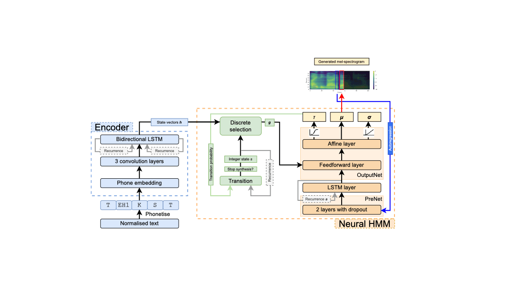

# Neural HMMs are all you need (for high-quality attention-free TTS)
##### [Shivam Mehta][shivam_profile], [Éva Székely][eva_profile], [Jonas Beskow][jonas_profile], and [Gustav Eje Henter][gustav_profile]
---

[paper_link]: https://arxiv.org/abs/2108.13320
[shivam_profile]: https://www.kth.se/profile/smehta
[eva_profile]: https://www.kth.se/profile/szekely
[jonas_profile]: https://www.kth.se/profile/beskow
[gustav_profile]: https://people.kth.se/~ghe/
[demo_page]: https://shivammehta007.github.io/Neural-HMM/
[ljspeech_link]: https://keithito.com/LJ-Speech-Dataset/
[github_link]: https://github.com/shivammehta007/Neural-HMM.git
[github_new_issue_link]: https://github.com/shivammehta007/Neural-HMM/issues/new
[docker_install_link]: https://docs.docker.com/get-docker/
[tacotron2_link]: https://github.com/NVIDIA/tacotron2
[pretrained_model_link]: https://github.com/shivammehta007/Neural-HMM/releases/download/Neural-HMM/Neural-HMM.ckpt
[hifigan_all]: https://drive.google.com/drive/folders/1-eEYTB5Av9jNql0WGBlRoi-WH2J7bp5Y
[hifigan_t2]: https://drive.google.com/drive/folders/1dqpUYEYF_hH7T0rII9_VQbps45FvNBqf
[pytorch_lightning_link]: https://github.com/PyTorchLightning/pytorch-lightning
[pytorch_dataloader_issue_link]: https://github.com/pytorch/pytorch/issues/57273


This is the official code repository for the paper "[Neural HMMs are all you need (for high-quality attention-free TTS)][paper_link]". For audio examples, visit our [demo page][demo_page]. A [pre-trained model][pretrained_model_link] is also available.



## Setup and training using LJ Speech
1. Download and extract the [LJ Speech dataset][ljspeech_link]. Place it in the `data` folder such that the directory becomes `data/LJSpeech-1.1`. Otherwise update the filelists in `data/filelists` accordingly.
2. Clone this repository ```git clone https://github.com/shivammehta007/Neural-HMM.git``` 
   * If using single GPU checkout the branch ```gradient_checkpointing``` it will help to fit bigger batch size during training. 
   * Use `git clone --single-branch -b gradient_checkpointing https://github.com/shivammehta007/Neural-HMM.git` for that.
3. Initalise the submodules ```git submodule init; git submodule update```
4. Make sure you have [docker installed][docker_install_link] and running.
    * It is recommended to use Docker (it manages the CUDA runtime libraries and Python dependencies itself specified in Dockerfile)
    * Alternatively, If you do not intend to use Docker, you can use pip to install the dependencies using ```pip install -r requirements.txt``` 
5. Run ``bash start.sh`` and it will install all the dependencies and run the container.
6. Check `src/hparams.py` for hyperparameters and set GPUs.
    1. For multi-GPU training, set GPUs to ```[0, 1 ..]```
    2. For CPU training (not recommended), set GPUs to an empty list ```[]```
    3. Check the location of transcriptions
7. Once your filelists and hparams are updated run `python generate_data_properties.py` to generate `data_parameters.pt` for your dataset (the default `data_parameters.pt` is available for LJSpeech in the repository).
8. Run ```python train.py``` to train the model.
    1. Checkpoints will be saved in the `hparams.checkpoint_dir`.
    2. Tensorboard logs will be saved in the `hparams.tensorboard_log_dir`.
9. To resume training, run ```python train.py -c <CHECKPOINT_PATH>```

## Synthesis
1. Download our [pre-trained LJ Speech model][pretrained_model_link]. 
(This is the exact same model as system NH2 in the paper, but with training continued until reaching 200k updates total.)
2. Download HiFi gan pretrained [HiFiGAN model][hifigan_all].
    - We recommend using [fine tuned][hifigan_t2] on Tacotron2 if you cannot finetune on NeuralHMM. 
3. Run jupyter notebook and open ```synthesis.ipynb```.


## Miscellaneous
### Mixed-precision training or full-precision training
* In ```src.hparams.py``` change ```hparams.precision``` to ```16``` for mixed precision and ```32``` for full precision.
### Multi-GPU training or single-GPU training
* Since the code uses PyTorch Lightning, providing more than one element in the list of GPUs will enable multi-GPU training. So change ```hparams.gpus``` to ```[0, 1, 2]``` for multi-GPU training and single element ```[0]``` for single-GPU training.


### Known issues/warnings

#### PyTorch dataloader
* If you encounter this error message ```[W pthreadpool-cpp.cc:90] Warning: Leaking Caffe2 thread-pool after fork. (function pthreadpool)```, this is a known issue in [PyTorch Dataloader][pytorch_dataloader_issue_link]. 
* It will be fixed when PyTorch releases a new Docker container image with updated version of Torch. If you are not using docker this can be removed with ```torch > 1.9.1```

#### Torchmetric error on RTX 3090
* If you encoder this error message ```ImportError: cannot import name 'get_num_classes' from 'torchmetrics.utilities.data' (/opt/conda/lib/python3.8/site-packages/torchmetrics/utilities/data.py)```
* Update the requirement.txt file with these requirements: 
```python
torch==1.11.0a0+b6df043
--extra-index-url https://download.pytorch.org/whl/cu113
torchmetrics==0.6.0
```

## Support
If you have any questions or comments, please open an [issue][github_new_issue_link] on our GitHub repository.

## Citation information
If you use or build on our method or code for your research, please cite our paper:
```
@inproceedings{mehta2022neural,
  title={Neural {HMM}s are all you need (for high-quality attention-free {TTS})},
  author={Mehta, Shivam and Sz{\'e}kely, {\'E}va and Beskow, Jonas and Henter, Gustav Eje},
  booktitle={Proc. ICASSP},
  year={2022}
}
```
## Acknowledgements
The code implementation is based on [Nvidia's implementation of Tacotron 2][tacotron2_link] and uses [PyTorch Lightning][pytorch_lightning_link] for boilerplate-free code.
